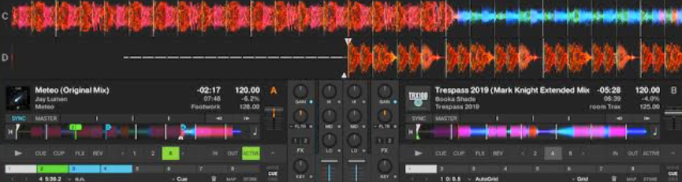
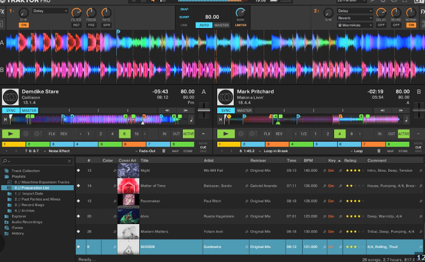

# Discocs DJ Workspace

## Design document and delivery plan

**Status:** foundation plan ready for implementation
**Purpose:** product and architecture source of truth
**Scope:** user interface, shared two-deck audio runtime, waveform/timeline analysis foundation, tempo/sync and settings surface
**Not in scope:** Auto DJ execution, automatic-mixing algorithms, transition strategy selection, or playlist construction; these form a separate future epic

### Document set

- this document defines product scope, accepted decisions and delivery gates;
- `PLAYBACK_ENGINE_TECHNICAL_PLAN.md` defines the shared browser runtime, command/state contracts and migration from the current player;
- `TIMELINE_ANALYSIS_TECHNICAL_PLAN.md` defines the reusable analysis artifact, storage, API and lifecycle;
- `IMPLEMENTATION_PLAN.md` contains the executable vertical slices, tests and documentation work.

Engineering choices that do not materially change UX/UI are resolved in these documents without requiring additional product approval. Product review is requested only for a real user-facing tradeoff.

---

## 1. Product concept

Discocs gains an expandable **DJ control surface**: a viewable and controllable two-deck environment inspired by the working model of Traktor Pro. It is an advanced presentation of the main player, not a separate playback mode or a second audio application.

The player must support two independent capabilities through the same controls and audio engine:

1. **Advanced manual control** — an explicit interface command opens the DJ control surface, where the user operates decks, waveform navigation, loops, tempo, EQ, filters, channel faders, effects and crossfader.
2. **Background automatic control** — a future Auto DJ subsystem may be enabled independently of whether the DJ control surface is open. It operates the same controls and transports. Every automatic action remains visible when the surface is opened, understandable and interruptible by the user.

The current playlist and autoplay logic remain responsible for deciding which track comes next. The shared player engine receives the current and next tracks and is responsible only for playback, preparation, manipulation and transition execution.

### 1.1 Activation and presentation

The ordinary Discocs player and the DJ control surface are two presentations of one playback runtime:

- normal playback uses one program deck and keeps the second deck empty or prepared;
- opening the DJ control surface never reloads or interrupts the playing track;
- opening the surface prepares the next queued track on the free deck when one is available;
- closing the surface changes presentation only and does not stop an active mix;
- Auto DJ has its own enable/disable control and can continue operating while the advanced surface is closed;
- when background mixing is active, the compact player shows an unambiguous active-mix indicator and a command to open the full control surface.

The command that opens the control surface must not be labelled or behave as the Auto DJ toggle. Final naming and placement of that interface command remain a visual-design decision.

### 1.2 Presentation and initial platform baseline

The expanded DJ control surface is implemented as a full-screen layer mounted inside the existing authenticated `AppShell`, following the lifecycle and navigation model of the current Expanded Player. It is not a separate playback route or separately mounted audio runtime.

Initial support targets current desktop Chromium browsers on laptop/desktop layouts. The surface is designed for mouse and Pointer Events first and remains usable on landscape tablets where space permits. The existing compact player remains the supported phone experience; a dense two-deck phone layout is not a foundation requirement. Firefox and Safari receive capability detection and safe fallback, but do not block the first release until the Web Audio, AudioWorklet and WASM spikes establish support.

---

## 2. Reference interface

The initial visual and interaction reference is Traktor Pro:

- two detailed, horizontally moving, frequency-coloured waveforms at the top;
- fixed or clearly readable playhead positions;
- compact full-track overviews;
- deck metadata and transport controls;
- loop, cue, sync and tempo controls;
- central mixer with gain, EQ, filter, channel faders and crossfader;
- effects area;
- queue/library area below the decks;
- clear visual indication of active, prepared and automated states.

The goal is to reproduce the familiar **layout, information hierarchy and operating model**, not proprietary branding, logos or copyrighted graphical assets. Discocs should use its own visual language while preserving the recognisable DJ workflow.

### Reference screenshots

---

## 3. Core design principles

### 3.1 Reviewable vertical slices

The product surface must become reviewable early, but it is built on the real runtime contract rather than ahead of it. The first production slice migrates ordinary playback to the shared engine without changing UX; the second adds two-deck behaviour; the expanded interface follows immediately on those real snapshots and commands. Automatic-DJ decision algorithms remain later work.

The interface must not be a static mock-up. Controls, waveform navigation, deck state and mixer state must be connected to a real runtime model from the beginning, even where some advanced DSP functions initially use simplified implementations.

### 3.2 One engine for ordinary playback, manual mixing and automatic control

Ordinary one-track playback, advanced manual interaction and future automation must use the same deck and mixer command model. Automatic mixing must not imitate mouse movements or manipulate React components. It must issue commands to the same audio engine used by physical UI controls.

The existing single-deck `AudioEngine` evolves into a shared two-deck `PlaybackEngine` rather than coexisting with a separate `DjEngine`. The engine always exposes Deck A, Deck B and a mixer, while allocating or loading the free deck lazily. One deck is designated as the current program deck. After a completed handover, the program role alternates between the physical decks; audio is not copied or reloaded merely to rename the decks.

The existing compact player and `playerStore` may remain as a compatibility facade during migration, but React components must no longer own or bypass the shared playback runtime.

### 3.3 Browser-local real-time path

Both tracks are already buffered locally in the browser before a transition is required. Real-time playback and mixing therefore happen entirely in the browser.

The backend is not part of the live audio path. It prepares audio metadata and analysis artifacts in advance, but network delay must not determine the timing or continuity of playback.

Full local readiness of the incoming deck is mandatory for Auto DJ transitions but not for ordinary manual playback. A deck is ready for automatic transition only when its compressed audio is locally available, duration and source metadata are known, the deck source is initialized, and required timeline analysis is available.

The runtime retains at most two complete compressed track payloads: the
program/outgoing track and the prepared/incoming track. In the Phase 6
Signalsmith path both locally buffered payloads are decoded completely in the
browser and transferred to their physical deck worklets. This is deliberately
bounded by the two-deck model; it is not a streaming decoder and does not add a
backend PCM endpoint. After handover, the retired outgoing compressed payload,
decoded/worklet buffers and object URL are released before the free deck
prepares the following queue item.

Manual playback retains a streaming fallback. Auto DJ must not begin a transition from a partially prepared deck. If preparation fails, it marks the item unavailable for the transition, attempts another queued item where policy permits, and otherwise allows the current track to finish through ordinary playback while exposing the failure state.

### 3.4 Observable and interruptible automation

The future automatic-DJ subsystem must expose what it is doing:

- selected transition or manoeuvre;
- prepared cue and loop ranges;
- scheduled control changes;
- active automation on knobs and faders;
- current phase of a transition;
- ability for the user to take manual control.

This requirement affects the runtime and state model now, even though the automatic decision algorithms remain a later TODO.

### 3.5 Analysis describes the track; algorithms make decisions later

Precomputed analysis should contain reusable observations tied to the track timeline. It should not prematurely encode final judgements such as “best transition point” or “recommended loop”. Those decisions belong to future automatic-DJ algorithms and depend on context.

---

## 4. Scope of the first DJ control surface

The first complete expanded surface should contain the following visible areas.

### 4.1 Deck A and Deck B

Each deck includes:

- detailed moving coloured waveform;
- compact overview waveform;
- current position and remaining time;
- title, artist, cover and relevant track metadata;
- BPM, tempo adjustment and sync state;
- play/pause and cue controls;
- seeking and waveform drag by mouse or touch;
- loop enable, loop size and loop position controls;
- hot-cue/cue marker surface prepared for later expansion;
- gain, low/mid/high EQ and filter;
- channel level meter and channel fader;
- visible automation/manual-control state.

For the foundation, **cue** means a deck transport cue point. Separate headphone/PFL monitoring and audio-device routing are deferred and must not block the two-deck player.

### 4.2 Mixer

The central mixer includes:

- per-deck gain;
- three-band EQ;
- filter;
- channel faders;
- crossfader;
- master output level;
- master limiter/protection indication;
- effect routing and wet/dry controls, initially with a bounded basic set;
- clear representation of values changed by automation.

### 4.3 Queue and library context

The lower area should preserve the Discocs context rather than becoming a separate application:

- current queue;
- next track indication;
- track browser or source context;
- ability to load or prepare a track on either deck where applicable;
- existing autoplay remains responsible for extending the queue.

### 4.4 Future Auto DJ integration area

The layout and runtime boundaries must leave room for future automation, but the foundation does not implement or expose a non-functional Auto DJ control surface. The separate Auto DJ epic will define:

- background automatic mixing enable/disable, independent of whether the control surface is open;
- current automation state;
- selected transition/manoeuvre name;
- upcoming actions and their timing;
- cancel, skip immediately and take-over controls;
- debug details available behind an optional panel.

No placeholder should imply that Auto DJ is available before that epic is implemented.

---

## 5. Fixed technology stack

### 5.1 Existing Discocs frontend stack

Continue using the current application stack:

- React;
- TypeScript;
- Vite;
- React Router;
- TanStack Query;
- Zustand for persistent UI/player-facing state;
- Tailwind CSS and shadcn/ui for ordinary application controls and layout;
- Vitest and the existing frontend test infrastructure.

### 5.2 Waveform and deck visualisation

Use **PixiJS** as the dedicated renderer for:

- detailed moving waveforms;
- overview waveforms;
- frequency colouring;
- beat/bar/cue/loop overlays;
- zoom and smooth scrolling;
- mouse, pen and touch interactions;
- future transition and automation overlays.

React owns the page layout and control components. PixiJS owns the high-frequency drawing surface and pointer interaction for the waveforms.

### 5.3 Audio runtime

Use the **Web Audio API** as the browser audio graph and timing foundation:

- two deck sources;
- per-deck gain, EQ, filter and effects;
- channel faders and crossfader;
- master processing and output;
- scheduled parameter automation.

Introduce an independent `PlaybackEngine` runtime boundary between React and Web Audio. It replaces the current engine incrementally and serves both the compact player and the DJ control surface. React displays state and issues commands; it does not own audio timing.

The runtime contains two stable physical deck identities, a mixer, master processing and a scheduler. The compact player projects the state of the current program deck; it is not backed by a third audio source.

Use **AudioWorklet** as the extension point for timing-critical or custom DSP operations. The first workspace does not need to move every operation into a worklet immediately, but the architecture must permit it without replacing the UI or command model.

Use **Signalsmith Stretch for Web/WASM** as the selected final foundation for pitch-preserving tempo changes, subject to an early compatibility and quality validation spike.

Tempo and sync are delivered incrementally:

1. the first functional two-deck engine may use `HTMLMediaElement.playbackRate` with browser pitch preservation as a temporary implementation;
2. deck sources must be hidden behind a transport/source boundary so this temporary implementation does not leak into UI or queue contracts;
3. Signalsmith/AudioWorklet tempo processing and beat-aware sync must be completed after timeline beat data is available and before automatic transition execution is considered ready.

The native playback-rate step is an explicit intermediate milestone, not the final completion state of tempo and sync.

### 5.4 Backend analysis stack

Continue using the existing FastAPI, FFmpeg and Essentia-based analysis infrastructure. Heavy or optional analysis may continue through the existing worker mechanism.

The backend prepares timeline and visual artifacts ahead of playback. It does not render or stream the final mixed output during normal DJ Workspace operation.

---

## 6. Runtime boundaries

The system is divided into three conceptual layers.

### 6.1 Player presentations

Responsible for:

- compact ordinary-player layout and controls;
- expandable DJ control-surface layout and controls;
- waveform presentation and gestures;
- visible deck/mixer state;
- manual-control ownership;
- automation presentation;
- queue and library context.

### 6.2 Shared playback engine

Responsible for:

- two-deck transport state;
- program-deck and free-deck roles;
- browser-local audio graph;
- mixer and effect parameters;
- timing and scheduling;
- loop, cue, tempo and seek commands;
- command ownership between manual and automatic control;
- stable event and snapshot model for the UI;
- future execution of automatic transition plans.

### 6.3 Backend preparation

Responsible for:

- serving buffered track audio through the existing media path;
- precomputing waveform and timeline analysis;
- versioning and invalidating analysis artifacts;
- exposing analysis availability and rebuild operations;
- storing settings and optional transition diagnostics later.

### 6.4 Queue and deck lifecycle

The queue and deck lifecycle use distinct concepts:

- **loaded** — a track is available on a deck but has not necessarily started;
- **started** — the deck transport has begun playback;
- **program** — the deck is the compact player's canonical current track;
- **handover** — the incoming deck becomes the program deck and the playback session advances to its queue item;
- **completed/skipped** — the outgoing track leaves the active mix with the appropriate playback outcome.

Loading or starting the next queued track on the free deck must not by itself advance the server-side queue. Queue advancement happens through an explicit handover command so crossfader movement cannot accidentally move the queue back and forth.

The physical Deck A and Deck B identities remain stable. Their runtime roles alternate between program, incoming, outgoing and free/prepared without copying or reloading audio merely to keep the current track on a particular side.

Handover follows these rules:

- an automatic transition schedules an explicit handover action at a defined transition phase;
- manual crossfader or channel-fader movement never advances or rewinds the queue by itself;
- a manual handover may be requested explicitly by making the incoming deck the program deck, by stopping or unloading the outgoing deck while the incoming deck is playing, or by using the global Next command;
- the global Next command performs a fast protected handover to the prepared deck and records the outgoing item as skipped; if no deck is prepared, it falls back to loading the next queue item;
- deck-local transport controls affect only their deck and do not implicitly advance the queue;
- the handover operation must be idempotent and must update the compact-player projection, Media Session metadata and canonical server-side queue item without reloading the incoming audio source.

The server remains canonical for the playback session, queue and current program queue item. High-frequency deck transport, mixer and crossfader state remain browser-local. Foundation playback events must distinguish an incoming track starting, handover completion and manual transition completion or cancellation; exact event names and payloads are part of the implementation contract.

### 6.5 Deck preparation state

Each deck exposes an explicit preparation state such as `empty`, `loading`, `ready`, `streaming`, or `unavailable`. The state is observable in both compact and expanded presentations where it affects continuity.

The existing playback profile is used initially for both decks. A separate DJ codec or forced transcoding profile is not required for the foundation. Profile changes must not invalidate one side of an active transition; memory and payload-size telemetry should inform any later DJ-specific transcoding policy.

### 6.6 Reserved automation boundary

Foundation commands may carry an origin (`manual`, future `automation`, or `system`) and the engine publishes stable observations. The foundation does not define the complete ownership, scheduler, cancellation or takeover policy.

The separate Auto DJ epic will decide those behaviours against the working manual engine. Its automation must use the same public commands and may not manipulate React components or private audio nodes.

---

## 7. Precomputed track analysis foundation

A new reusable **Track Timeline Analysis Pack** should be introduced. It provides data for the interface and future algorithms without deciding how the tracks should be mixed.

### Required foundation

- multi-resolution waveform pyramid;
- frequency-colour data for the waveform;
- beat timestamps and confidence;
- downbeats, bars and meter where available;
- local tempo/tempo curve;
- onset or transient-strength curve;
- short-term loudness/energy curve;
- low-, mid- and high-frequency energy curves;
- structural novelty/boundary curve.

### Optional follow-up analysis packs

Prepare the design so these can be added independently:

- vocal activity;
- drum activity;
- bass activity;
- melodic activity;
- local chroma/harmonic activity;
- improved structural labels;
- stem generation or stem references.

### Deliberately deferred derived decisions

The foundation must not yet define:

- best cue points;
- best loops;
- transition-safe sections;
- transition type recommendations;
- automatic-DJ strategy scores.

These remain TODO items for later design work and consume the common timeline analysis.

---

## 8. State and control concept

The shared player needs an explicit runtime state separate from ordinary React component state.

At a conceptual level it must expose:

- Deck A state;
- Deck B state;
- mixer state;
- loaded and prepared tracks;
- playhead and transport state;
- loop/cue state;
- manual versus automated ownership of each control;
- scheduled actions;
- active transition state;
- audio capability and error state.

All user-facing controls and future automation operate through a common command surface. UI animation reflects the engine state; it is not the source of truth for audio parameters.

Exact class names, event schemas and file placement live in the linked technical and implementation plans so this product baseline remains readable.

---

## 9. Administration and settings

The operational admin interface must gain a dedicated **DJ Workspace / Auto DJ** settings block for instance-wide controls. Per-user interaction, waveform and playback preferences belong to the authenticated Settings page. Transient enabled, suspended and transition state belongs to the playback session/runtime rather than either persistent settings surface.

It should be designed before automatic mixing is implemented, so future algorithm settings do not become scattered hard-coded values.

The block should cover the following categories.

### 9.1 Feature and capability controls

- enable or disable the advanced DJ control surface;
- enable or disable automatic mixing independently;
- capability checks and supported-browser status;
- experimental-feature flags.

### 9.2 Analysis management

- required analysis-pack status;
- queue or rebuild missing timeline analysis;
- extractor versions and stale-artifact indication;
- optional analysis packs enabled for the instance;
- storage and cleanup visibility for waveform artifacts.

### 9.3 Audio runtime defaults

- default audio quality/profile;
- preload/buffering policy;
- preferred latency/performance profile;
- master protection/limiter defaults;
- default deck, mixer and effect values;
- behaviour when an advanced capability is unavailable.

### 9.4 Interaction defaults

- waveform colour preset;
- waveform zoom and follow behaviour;
- touch/mouse drag behaviour;
- quantisation defaults;
- default loop sizes;
- persistence of manual layout preferences.

### 9.5 Future automatic-DJ behaviour

Reserve a structured settings section for later work, including:

- automation enabled state;
- broad behaviour profile;
- transition timing constraints;
- permitted transition/manoeuvre families;
- aggressiveness and intervention policy;
- fallback behaviour;
- debug and explanation level.

The actual algorithms and final parameter set remain TODO. The current task is to establish a coherent settings home and persistence model.

---

## 10. Delivery sequence

Development proceeds as gated vertical slices. Each slice must leave the ordinary player working and must include tests and documentation in the same logical change. Detailed tasks are in `IMPLEMENTATION_PLAN.md`.

### Phase 0 — contracts and risk spikes

- freeze the `PlaybackEngine` public contract and migration seam;
- validate a two-source Web Audio graph with uninterrupted single-deck playback;
- validate PixiJS v8 lifecycle, resizing and two simultaneous waveform surfaces;
- validate the official Signalsmith Web Audio WASM/AudioWorklet package, asset delivery, seeking, looping, latency reporting and scheduling;
- record capability results for the browser baseline;
- freeze Timeline Analysis Pack v1 format before backend implementation.

**Gate:** no unresolved risk can force replacement of the engine command model, waveform artifact format or expanded-player mounting model.

### Phase 1 — one-deck PlaybackEngine migration

- introduce `PlaybackEngine` and a single active Deck A behind a compatibility adapter;
- move ordinary playback through the neutral Web Audio graph;
- preserve current queue, prefetch, restore, Media Session, volume and event behaviour;
- keep the existing compact and expanded UI visually unchanged.

**Gate:** the existing player uses the new runtime with no user-visible regression; removing or bypassing the new engine makes the migration tests fail.

### Phase 2 — second deck, mixer and handover

- turn the current next-track prefetch into preparation of the free physical deck;
- add Deck B, mixer graph, pre-crossfader deck metering, centre-unity DJ
  crossfader and explicitly configured protected master output;
- add explicit idempotent handover without reloading the incoming source;
- release the outgoing payload and prepare the following queue item;
- implement fast protected Next and browser-local deck preparation states.

**Gate:** two local tracks overlap, handover advances the canonical queue exactly once, and normal playback still works with the second deck unused.

### Phase 3 — expanded DJ control surface

- add the full-screen layer to `AppShell` using the existing Expanded Player pattern;
- expose both decks, mixer, queue context and preparation state;
- connect every implemented control to engine commands and snapshots;
- keep unavailable future controls visibly disabled or omit them rather than simulating success;
- add compact-player active-mix indication and entry back into the expanded surface.

**Gate:** the user can open and close the surface without transport discontinuity and manually complete a two-deck transition.

### Phase 4 — waveform artifact and Pixi renderer

- implement the versioned multi-resolution waveform and frequency-band artifact;
- add manifest/payload/status API and lifecycle management;
- render detailed and overview waveforms for both decks;
- implement live follow, fixed-centre tape geometry, click/drag seeking and
  overview cursor dragging using engine time as the source of truth.

**Gate:** real tracks render smoothly on both decks, seeking remains synchronized, and stale artifacts are rejected and rebuildable.

### Phase 5 — complete Timeline Analysis Pack

- add beats, downbeats/bars, tempo curve, onset, loudness, band energy and structural novelty;
- expose analysis availability and rebuild operations through existing durable jobs;
- add timeline overlays without encoding transition recommendations.

**Gate:** UI and future automation consume one versioned timeline contract, and file changes invalidate it by path, mtime and file size.

### Phase 6 — production tempo and beat sync

- integrate Signalsmith behind the established deck-source boundary;
- implement pitch-preserving tempo adjustment, beat phase alignment, loops and drift correction;
- keep native playback rate only as an explicit degraded capability;
- verify scheduling and recovery around seek, loop and handover.

**Gate:** supported browsers pass defined quality, drift and continuity checks; automatic transitions cannot be enabled before this gate.

### Phase 7 — settings and diagnostics

- place instance-wide feature flags, analysis lifecycle, storage and capability diagnostics in the private admin;
- place per-user interaction, waveform and playback defaults in the authenticated Settings page;
- expose actionable fallback reasons.

**Gate:** operational and user preferences have one documented owner and are changeable without code edits.

### Future Epic B — Auto DJ and automatic mixing

- design the transition/manoeuvre catalogue and decision model;
- define the automation execution, observation, conflict and takeover contracts;
- implement scheduled action batches using audio-context time;
- expose planned and active automation in compact and expanded views;
- add evaluation, diagnostics and quality scoring.

This epic begins only after the foundation phases pass their gates. Its details are deliberately not frozen by the foundation plan because automatic mixing has its own product, DSP and evaluation subtleties.

---

## 11. Explicit non-goals for this plan

This document does not specify:

- how the next track is selected;
- how playlists or autoplay are generated;
- which automatic transition methods will exist;
- how a transition method decides where to start;
- how transition candidates are ranked;
- whether ML will be used;
- detailed DSP algorithms;
- database tables, endpoint names, module names or source-file placement;
- final visual polish or exact pixel measurements.

The following capabilities are deliberately deferred beyond the foundation, but should remain compatible with the shared engine command model:

- Web MIDI controller discovery, mapping, feedback and user presets;
- headphone/PFL monitoring and multiple audio-output routing;
- true-peak master limiting;
- user-defined effect chains;
- recording or exporting the live mixed output.

Those topics should be addressed in follow-up documents after the interface and runtime foundation are in place.

---

## 12. Acceptance criteria for the foundation

The foundation is successful when:

1. A user can open the DJ control surface from the ordinary player and immediately recognise the two-deck Traktor-style operating model.
2. Opening or closing the control surface does not reload, pause or seek the playing track.
3. A two-deck manual mix continues while the control surface is closed, and the compact player indicates the active mix.
4. Two already-buffered tracks can play and overlap entirely in the browser without depending on a backend-rendered mixed stream.
5. The user can navigate both waveforms smoothly with mouse and touch.
6. Ordinary playback and manual deck controls operate the shared playback engine rather than separate runtimes or local component state.
7. Preparing the free deck does not advance the queue; an explicit handover changes the program deck and canonical current queue item.
8. The engine exposes stable deck/mixer commands and observations that a separately designed Auto DJ epic can consume without manipulating React components.
9. Waveform and timeline analysis is precomputed, versioned and reusable by both UI and later algorithms.
10. The private admin contains coherent DJ foundation, analysis and capability settings, with future Auto DJ settings reserved for its separate epic.
11. Auto DJ remains unimplemented and does not block or masquerade as part of the working manual foundation.
12. Native playback rate is treated as an intermediate implementation; validated Signalsmith tempo and beat sync are completed before automatic transition execution is enabled.
13. The engine exposes full incoming-deck readiness for the future Auto DJ epic, while manual playback can retain a streaming fallback.

---

## 13. Follow-up TODO documents

After this foundation is accepted, prepare separate design work for:

- the complete Auto DJ epic, including execution, observation and manual takeover;
- automatic transition/manoeuvre catalogue;
- transition context and decision model;
- loop and cue opportunity detection;
- automation conflict and manual takeover policy;
- evaluation and debugging workflow;
- optional stem-assisted mixing;
- mobile support and background-playback constraints;
- Web MIDI controller integration, mapping and feedback;
- native-host integration, if later required;
- headphone/PFL monitoring and multiple-output routing, if later required.

---

## 14. Decision status

There are no open product decisions blocking Phase 0, Phase 1 or Phase 2.

The following visual details are intentionally decided during Phase 3 against a working runtime and do not block engineering:

- final label/icon and exact placement of the command that opens the mixer/control surface;
- final density, spacing and responsive breakpoints inside the full-screen layer;
- final waveform colour presets and decorative styling.

A new product question should be raised only if a technical spike requires a visible loss of capability, a different activation model, a different supported-device baseline or a material change to the accepted two-deck workflow.
